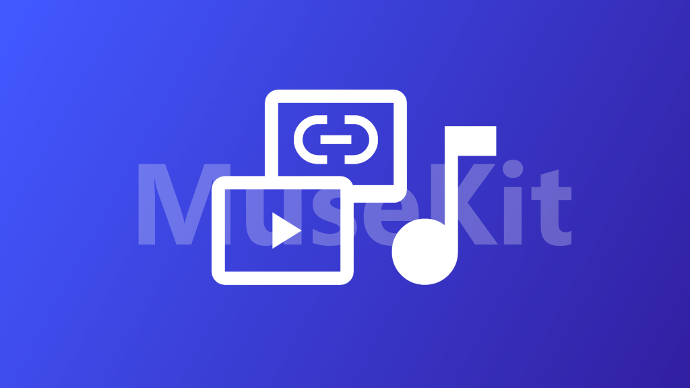

# Muse-Kit

My MuseScore Plugin Kit: Score media sync and more  
我的 MuseScore 插件套组：乐谱媒体同步和更多功能

## Introduction

This repository is a collection of MuseScore plugins developed by myself, aiming to speed up my workflow and add some features I need.

## Usage

### Prerequisites

All plugins in MuseKit are targeted for **MuseScore 4.x** and not compatible with MuseScore 3.x. Specifically, MuseScore 4.7 is the recommended version for the best experience.

### Installation

#### 1. Download the Plugins

- If you want to use the **stable versions**, you can download the latest release from the [Releases](https://github.com/isHarryh/Muse-Kit/releases) page.

- If you want to use the **latest development versions**, you can download the source code from this repository.

#### 2. Copy to Plugin Directory

Unzip and copy the plugin folders to your MuseScore's plugin directory.

How to find the plugin directory?

1. Open MuseScore application.
2. Go to `Help` > `Diagnostics` > `System` > `Show Paths`.
3. Double-click the `appDataPath` item to open the folder in your file explorer.
4. You will find a `plugins` folder inside it, which is the plugin directory.

#### 3. Enable and Enjoy

Restart MuseScore application or click the "Reload Plugins" button in the plugin manager to load the new plugins.

Then you can find the added plugins in the plugin manager. They're disabled by default, so you need to enable them before use.

## Plugins Included

In [`src`](src/) directory of this repository, you can find the following plugins:

### MediaSync

🧩 **MediaSync** is a plugin that allows you to synchronize the playback of MuseScore with an external media file (audio or video). The media file will be opened in a web browser, communicating with MuseScore application via WebSocket.

When you play, pause or change the playback position in MuseScore, the media file will be controlled accordingly. You can also adjust the synchronization offset and tolerance for each media file to achieve better experience.

## Licensing

This project is licensed under the MIT License. See the [License](https://github.com/isHarryh/Muse-Kit/blob/main/LICENSE) file for more details.
